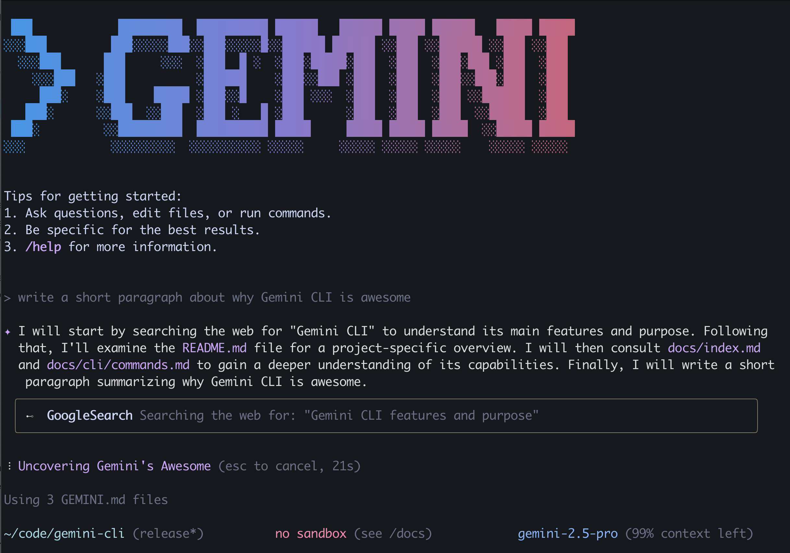

# Easy LLM CLI



这个仓库包含了 Easy LLM CLI（[Gemini Cli](https://github.com/google-gemini/gemini-cli)  的 Fork 版本），一个连接到您的工具、理解您的代码并加速您工作流程的命令行 AI 工具。它支持多种 LLM 提供商，包括 Gemini、OpenAI 以及任何遵循 OpenAI API 格式的自定义 LLM API。

使用 Easy LLM CLI，您可以：

- 利用先进的 LLM 能力查询和编辑大型代码库，支持大上下文窗口
- 使用多模态能力从 PDF 或草图生成新应用
- 自动化操作任务，如查询 Pull Request 或处理复杂的 rebase 操作
- 使用工具和 MCP 服务器连接新功能
- 通过简单的环境变量配置和使用您首选的 LLM 提供商
- 在不改变工作流程的情况下无缝切换不同的 LLM 提供商

## 快速开始

1. **前提条件：** 确保您安装了 [Node.js 20 版本](https://nodejs.org/en/download) 或更高版本。
2. **运行 CLI：** 在您的终端中执行以下命令：

   ```bash
   npx https://github.com/ConardLi/easy-llm-cli
   ```

   或者使用以下命令安装：

   ```bash
   npm install -g easy-llm-cli
   elc
   ```

3. **选择一个颜色主题**

## 自定义 LLM 配置

Easy LLM CLI 支持连接到任何兼容 OpenAI 的 LLM API。您可以使用以下环境变量配置您首选的 LLM：

```bash
# 启用自定义 LLM 支持
export CUSTOM_LLM_API_KEY="your-api-key"     # 您的 LLM 提供商 API 密钥
export CUSTOM_LLM_ENDPOINT="https://api.your-llm-provider.com/v1"  # API 端点
export CUSTOM_LLM_MODEL_NAME="your-model-name"  # 模型名称

# 可选参数
export CUSTOM_LLM_TEMPERATURE=0.7  # 温度 (默认: 0)
export CUSTOM_LLM_MAX_TOKENS=8192  # 最大令牌数 (默认: 8192)
export CUSTOM_LLM_TOP_P=1          # Top P (默认: 1)
```

设置这些变量后，Easy LLM CLI 将使用您的自定义 LLM 而不是默认的 Gemini 模型。


## 使用 Easy LLM CLI

在命令行中输入 `elc` 即可开始使用。

创建一个新项目：

```sh
cd new-project/
elc
> 使用我提供的 FAQ.md 文件编写一个能回答问题的 Discord 机器人
```

或者处理现有项目：

```sh
git clone https://github.com/ConardLi/easy-llm-cli
cd easy-llm-cli
elc
> 给我一份昨天所有变更的摘要
```

### 上传文件

上传文件以生成或修改代码。只需要将文件拖放到终端窗口或者使用 `/upload` 命令：

```text
> /upload path/to/file.jpg
```

Easy LLM CLI 将读取文件内容并将其包含在下一个提示中。

### 工具

Easy LLM CLI 包含有用的内置工具，包括：

- `/help` - 显示所有可用命令
- `/clear` - 清除对话历史
- `/open` - 在系统默认应用程序中打开指定文件
- `/upload` - 上传文件内容以包含在您的下一个提示中

### 探索新的代码库

首先 `cd` 进入一个现有的或新克隆的仓库，然后运行 `elc`。

```text
> 描述这个系统架构的主要部分。
```

Easy LLM CLI 将分析代码库并给您一个概述。

### 创建和修改代码

Easy LLM CLI 可以通过引导方式逐步修改您的代码：

```text
> 将我的网站从蓝色主题改为深色主题
```

或者一次性创建新功能：

```text
> 为我的 React 应用程序创建一个登录表单
```

### 工作流自动化

使用 Easy LLM CLI 自动化常见的工作流程：

```text
> 从我的当前分支创建一个包含所有更改摘要的 PR
```

### 终端集成

对终端命令提出问题：

```text
> 解释这个 Docker 命令的作用： docker run -p 8080:80 -v $(pwd):/app nginx
```
