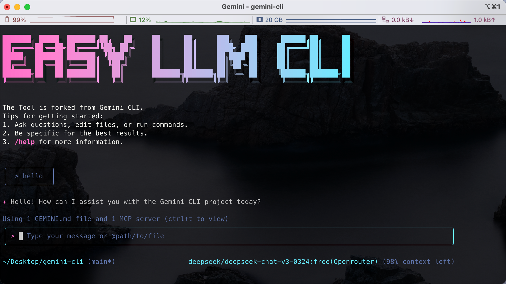

<div align="center">

<h4> 一个与多种大语言模型（LLM）兼容的开源 AI Agent CLI。  </h4>

[English](./README.md) | [简体中文](./README.zh-CN.md)

</div>

这个仓库包含了 Easy LLM CLI（[Gemini Cli](https://github.com/google-gemini/gemini-cli)  的 Fork 版本），一个连接到您的工具、理解您的代码并加速您工作流程的命令行 AI 工具。它支持多种 LLM 提供商，包括 Gemini、OpenAI 以及任何遵循 OpenAI API 格式的自定义 LLM API。

使用 Easy LLM CLI，您可以：

- 利用先进的 LLM 能力查询和编辑大型代码库，支持大上下文窗口
- 使用多模态能力从 PDF 或草图生成新应用
- 自动化操作任务，如查询 Pull Request 或处理复杂的 rebase 操作
- 使用工具和 MCP 服务器连接新功能
- 通过简单的环境变量配置和使用您首选的 LLM 提供商
- 在不改变工作流程的情况下无缝切换不同的 LLM 提供商

<hr />

本方案已经对多种不同提供商、模型以及本地部署的模型进行了多个维度（是否具备思考过程、能否完成简单任务、是否具备工具调用能力、是否具备多模态能力、是否具备复杂任务能力、是否可以统计 Toekn）的测试，以下是测试结果：

|  模型 | 思考过程 | 简单任务 | 工具调用 | MCP 调用 | 复杂任务 | 多模态 | Token 统计 |
| --- | --- | --- | --- | --- | --- | --- | --- |
| 【Google】Gemini-2.5-pro | ✅ | ✅ | ✅ | ✅ | ✅ | ✅ | ✅ | ✅ |
| 【OpenRouter】Claude Sonnet 4 | ✅ | ✅ | ✅ | ✅ | ✅ | ✅ | ✅ | ✅ |
| 【OpenRouter】Gpt-4.1 | ✅ | ✅ | ✅ | ✅ | ✅ | ✅ | ✅ | ✅ |
| 【OpenRouter】Grok-4 | ✅ | ✅ | ✅ | ✅ | ✅ | ✅ | ✅ | ✅ |
| 【Volcengine】Doubao-Seed-1.6 | ✅ | ✅ | ✅ | ✅ | ✅ | ✅ | ✅ | ✅ |
| 【Bailian】Qwen3-Plus | ✅ | ✅ | ✅ | ✅ | ✅ | ✅ | ✅ |
| 【Volcengine】DeepSeek-R1 | ✅ | ✅ | ✅ | ✅ | ✅ | ❌ | ✅ |
| 【Siliconflow】DeepSeek-R1 | ✅ | ✅ | ✅ | ✅ | ✅ | ❌ | ✅ |
| 【Volcengine】Doubao-1.5-Pro | ❌ | ✅ | ✅ | ✅ | ⚠️ | ❌ | ✅ |
| 【Volcengine】DeepSeek-V3 | ❌ | ✅ | ✅ | ✅ | ⚠️ | ❌ | ✅ |
| 【Bailian】Qwen3-235b-a22b | ✅ | ✅ | ✅ | ✅ | ⚠️ | ❌ | ✅ |
| 【vLLM】Qwen2.5-7B-Instruct | ❌ | ✅ | ✅ | ✅ | ⚠️ | ❌ | ✅ |
| 【vLLM】DeepSeek-R1--32B | ✅ | ✅ | ✅ | ✅ | ⚠️ | ❌ | ✅ |
| 【Ollama】Qwen2.5-7B-Instruct | ❌ | ✅ | ✅ | ✅ | ⚠️ | ❌ | ✅ |

## 快速开始

1. **前提条件：** 确保您安装了 [Node.js 20 版本](https://nodejs.org/en/download) 或更高版本。
2. **运行 CLI：** 在您的终端中执行以下命令：

```bash
   npx easy-llm-cli
```

或者使用以下命令安装：

```bash
   npm install -g easy-llm-cli
   elc
```

3. **选择一个颜色主题**
## 自定义 LLM 配置

Easy LLM 命令行工具支持连接到任何兼容 OpenAI 的 LLM API。你可以使用以下环境变量配置首选的 LLM：

```bash
# 启用自定义 LLM 支持
export USE_CUSTOM_LLM=true
export CUSTOM_LLM_API_KEY="your-api-key"     # 你的 LLM 提供商 API 密钥
export CUSTOM_LLM_ENDPOINT="https://api.your-llm-provider.com/v1"  # API 端点
export CUSTOM_LLM_MODEL_NAME="your-model-name"  # 模型名称

# 可选参数
export CUSTOM_LLM_TEMPERATURE=0.7  # 温度参数（默认值：0）
export CUSTOM_LLM_MAX_TOKENS=8192  # 最大令牌数（默认值：8192）
export CUSTOM_LLM_TOP_P=1          # Top P 参数（默认值：1）
```

当这些变量设置后，Easy LLM 命令行工具将使用你的自定义 LLM，而非默认的 Gemini 模型。


## 示例

一旦 CLI 运行起来，你就可以从 shell 中与 Gemini 交互了。

你可以从新目录开始一个项目：

```sh
cd new-project/
elc
> 帮我写一个 Discord 机器人，它能使用我将要提供的 FAQ.md 文件来回答问题
```

或者处理一个已有的项目：

```sh
git clone https://github.com/ConardLi/easy-llm-cli
cd easy-llm-cli
elc
> 给我总结一下昨天所有的变更内容
```

### 后续步骤

- 了解如何[贡献代码或从源码构建](./CONTRIBUTING.md)。
- 探索可用的**[CLI 命令](./docs/cli/commands.md)**。
- 如果遇到任何问题，请查看**[故障排除指南](./docs/troubleshooting.md)**。
- 如需更全面的文档，请参阅[完整文档](./docs/index.md)。
- 查看一些[热门任务](#热门任务)获取更多灵感。

### 故障排除

如果遇到问题，请查看[故障排除](docs/troubleshooting.md)指南。

## 热门任务

### 探索新代码库

首先进入一个已有的或新克隆的仓库，然后运行 `elc`。

```text
> 描述这个系统架构的主要组成部分。
```

```text
> 有哪些安全机制在运行？
```

### 处理现有代码

```text
> 为 GitHub 第 123 号 issue 实现初稿。
```

```text
> 帮我把这个代码库迁移到最新版本的 Java。先制定一个计划。
```

### 自动化工作流

使用 MCP 服务器将本地系统工具与企业协作套件集成。

```text
> 制作一个幻灯片，展示过去 7 天的 git 历史，按功能和团队成员分组。
```

```text
> 制作一个全屏网页应用，用于墙上显示器，展示我们互动最多的 GitHub 问题。
```

### 与系统交互

```text
> 将此目录中的所有图像转换为 png 格式，并根据 exif 数据中的日期重命名。
```

```text
> 按支出月份整理我的 PDF 发票。
```
